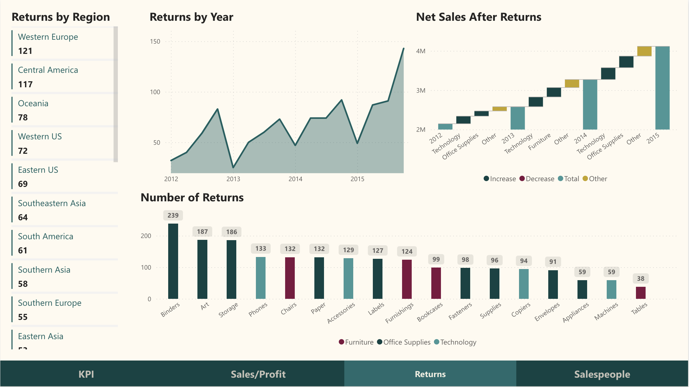

# superstore - Power BI Dashboard Project

## Project Overview
This project focuses on creating an insightful dashboard using Power BI to visualize sales data. The data involves sales orders, returns, and details about the salespeople across different regions.

## Data Sources
The data is sourced from three primary datasets:
1. `Orders`: Contains detailed records about each sale, including the order ID, sale date, customer details, product details, and sales figures.
2. `Returns`: Lists the orders that were returned, linked to the Orders dataset by the order ID.
3. `People`: Includes information about salespeople, with each person being responsible for a specific region.

## Data Preprocessing
The preprocessing steps include:
- Consolidating the 'Eastern Canada' and 'Western Canada' regions into 'Canada' in the People dataset.
- Merging the Orders dataset with the People dataset based on the 'Region' to include salesperson details in the sales records.
- Merging the Orders dataset with the Returns dataset based on the 'Order ID' to flag the returned orders.
- Imputing missing values in the 'Returned' column with 'No' to indicate orders that were not returned.

## Data Model
- The data model involves relationships between the Orders, Returns, and People datasets.
- The 'Order ID' is used as the primary key to link Orders with Returns.
- The 'Region' is used as the key to link Orders with People.

## Dashboard Features
The Power BI dashboard will visualize:
- Monthly sales trends across different product categories.
- Comparison of sales figures against returns.
- Performance metrics of salespeople across different regions.

## Setup and Usage
(TODO: Include steps on how to set up the Power BI environment, load data sources, and any specific instructions for interacting with the dashboard.)

## Future Improvements
(TODO: Outline potential improvements or additional features for the dashboard.)

## Contact Information
For support or queries, reach out to me at [my email address](mailto:albertevieites@gmail.com).

## Acknowledgements
Special thanks to [Yusuf Satilmis](https://github.com/yusufsjustit) for his invaluable assistance in this project.

