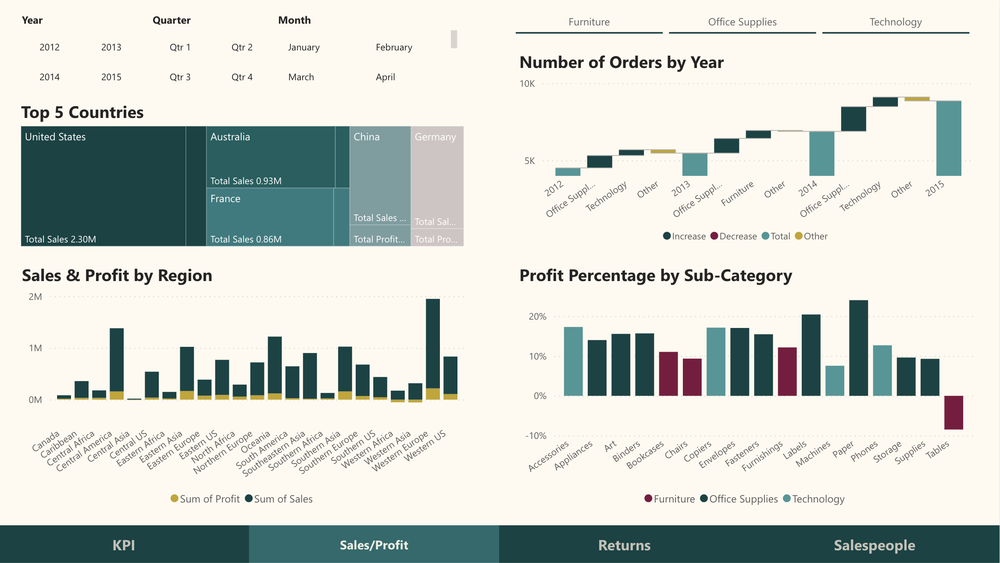

# superstore 

This project presents a dynamic and interactive **Power BI** dashboard that offers a comprehensive analysis of sales, profitability, returns, and individual salespeople performance within a company. It is designed to provide deep insights into the company's operations, highlighting areas for improvement and showcasing successes.

## Dataset Overview

The Superstore dataset is originally sourced from [data.world]("https://world"). The dashboard leverages a dataset that includes detailed information on orders, returns, and individual salespeople's performance metrics. The data spans several years and covers various categories and sub-categories of products.

### Data Model

The dataset is structured into three main tables:

- **Orders**: Contains sales, profit, quantity, and other attributes related to the orders.
- **Returns**: Tracks the returned orders with details such as Order ID and return status.
- **People**: Lists the salespeople along with their respective regions.

Key relationships are established between these tables to ensure comprehensive analysis capabilities across the dashboard.

## Data Preprocessing
The preprocessing steps include:
- Consolidating the 'Eastern Canada' and 'Western Canada' regions into 'Canada' in the People dataset.
- Merging the Orders dataset with the People dataset based on the 'Region' to include salesperson details in the sales records.
- Merging the Orders dataset with the Returns dataset based on the 'Order ID' to flag the returned orders.
- Imputing missing values in the 'Returned' column with 'No' to indicate orders that were not returned.

## Dashboard Features

1. **KPI Overview**: The dashboard presents key performance indicators (KPIs) such as total sales, profit, shipping costs, and returns at a glance.
2. **Sales and Profit Analysis**: Trends of sales and profits over time are displayed, providing insights into the business cycle and growth patterns.
3. **Returns Analysis**: The dashboard examines the returns data, offering insights into the reasons for returns and their impact on the overall profitability.
4. **Salespeople Performance**: Individual performances are ranked, highlighting top performers based on sales and profits generated.

## Visualizations

The Power BI dashboard will visualize:
- Monthly sales trends across different product categories.
- Comparison of sales figures against returns.
- Performance metrics of salespeople across different regions.

### KPI Overview:

This section of the dashboard presents the key performance indicators that offer a snapshot of the company's overall performance.

### Sales and Profit Analysis:

An in-depth look into the sales and profit figures, this visual tracks the company's financial health over time and across product categories.

### Returns Analysis:

This part of the dashboard focuses on the returns, providing insights into the patterns and impact of returned products.

### Salesperson Performance:

A detailed breakdown of each salesperson's performance, highlighting the top performers and areas for improvement.

## Usage

The dashboard is interactive and allows users to:

- Filter data by date, category, salesperson, and more.
- Drill down into specific data points for more detailed analysis.
- Export data visualizations as reports.

## Technologies Used

- **Power BI**: For data modeling, visualizations, and dashboard creation.
- **DAX**: Data Analysis Expressions used for creating calculated columns, measures, and custom tables within Power BI.

## Installation and Setup

To view and interact with the dashboard:

1. Install Power BI Desktop: [Download link](https://powerbi.microsoft.com/en-us/desktop/)
2. Clone this repository and open the `.pbix` file with Power BI Desktop.

## Contact Information
For support or queries, reach out to me at [my email address](mailto:albertevieites@gmail.com).

## Acknowledgements
Special thanks to [Yusuf Satilmis](https://github.com/yusufsjustit) for his invaluable assistance in this project.

